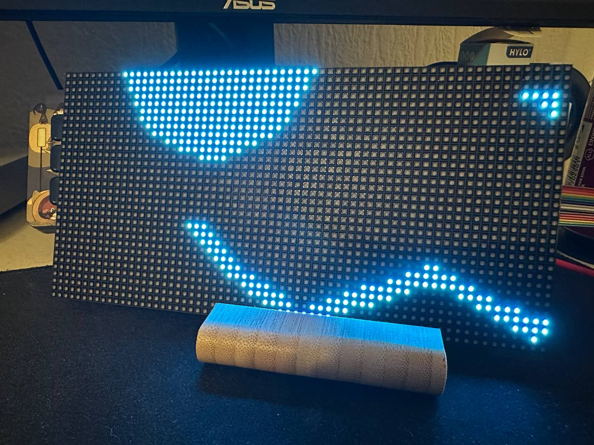

# Protogen Display Software with RGB LED Matrix

A software to display single images, image sequences and lottie animations for RGB LED panels with Raspberry Pi based on the [rpi-rgb-led-matrix](https://github.com/hzeller/rpi-rgb-led-matrix) library by [Henner Zeller](https://github.com/hzeller).

This software was primarily written for a friend and his protogen-head built with a Raspberry Pi 4 Model B, an ESP 32, two 64x32 RGB LED panels chained together and a bunch of sensors. It's been rewritten based on some concepts shown in the rpi-rgb-led-matrix examples with C-headers, anonymous singleton implementations and a sort of modular setup.

## Commands

Since this software is designed to work together with an ESP and other devices, it iis currently monitoring value changes in a redis database. The Raspberry Pi is connected to an ESP via a bluetooth LE connection and waits for commands to be read from a keypad. The received commands are then stored in a redis database to be distributed to multiple services like this one.

Each command is associated with a sequence that shows an image, plays multiple images, or plays a lottie animation. They can be configured in the config.json file in the build directory.

## Sequences

As mentioned in the commands section, a sequence is used to display one or more images and lottie animations. Just like commands they can be configured in the config.json file. The following types are currently supported:

| Sequence type | File Type | Available settings |
| ------------- | --------- | ------------------ |
| Single image | PPM (Single, Portable Pixmap Format) | none |
| Multiple images | PPM (Multiple, Portable Pixmap Format) | speed (int, default 20), waitAfter (int, default speed) |
| Lottie Animation | JSON (Single) | speed (int, default 20), waitAfter (int, default speed) |

Depending on the sequence type the content is loaded either from the image-loader with the image-sequence-system or from the lottie-system. Both systems load every available image or frame during initialization and store them for quick access, e. g. after changing commands.


## Installation

```
# Clone this repository
git clone https://github.com/vogeslu/rpi-protogen-display

# Fetch all submodules
git submodule update --init --recursive

# Install required libraries
sudo apt update
sudo apt install libhiredis-dev libjsoncpp-dev

# Build an install the rlottie libraries (you might need to install cmake & make)
cd rlottie
mkdir build && cd build
cmake ..
make -j 2
make install

# go back to project repository
cd ../..

# compile rpi-rgb-led-matrix & rpi-protogen-display, this might take some time because rpi-rg-led-matrix is as well compiling all examples
make

# a built executable can be found in ./build/ as rpi-protogen-display
```

## Run the software

To run this software correctly make sure you have installed and started `redis-server`. Check the [Wiring](https://github.com/hzeller/rpi-rgb-led-matrix/blob/master/wiring.md) to make sure that the content is displayed correctly.

Copy the `config-example.json`, rename it to `config.json` and edit anything you need. Be sure to check the width, height and chain-length settings to set up the display properly.

After everything set up you should start everything with:

```
cd ./build
sudo ./rpi-protogen-display
```

In some cases there may be warnings about audio drivers that are not disabled. See the [troubleshooting section](https://github.com/hzeller/rpi-rgb-led-matrix?tab=readme-ov-file#troubleshooting) in the rpi-rgb-led-matrix repository.

## Convert and create images/animations

### Convert images to ppm

To convert images such as PNG files, you can use online converters or use imagemagick locally. If you choose imagemagick and installed it you can run the following command to convert an image:

```
convert [image].png [image].ppm
```

In some cases you may need to add additional arguments which are documented in the imagemagick manuals.

### Create or download animations

You can either download existing animations from [lottiefiles.com](https://lottiefiles.com/) or create your own using tools like [Figma](https://www.figma.com/). Check out [this tutorial](https://www.youtube.com/watch?v=ajfKecCyNOs) to learn how to use the Lottiefiles plugin. Either way you end up with a .json-File that you can put in your animations directory and add your sequence to config.json.

## Examples

### Single image



### Multiple images with wait after

<video src="./.github/proto-images.mp4">

### Lottie animation

<video src="./.github/proto-lottie.mp4">